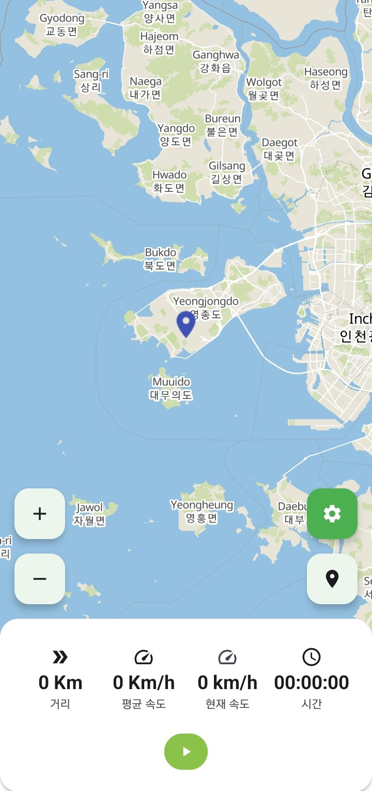
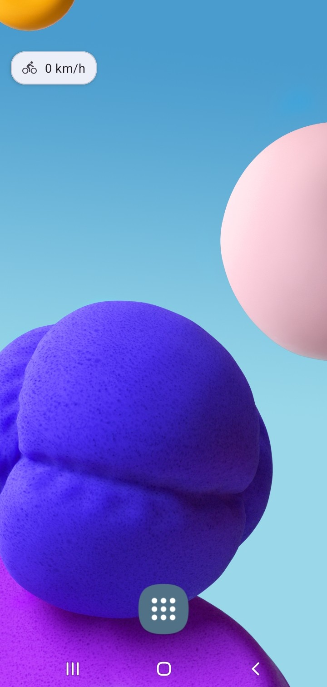
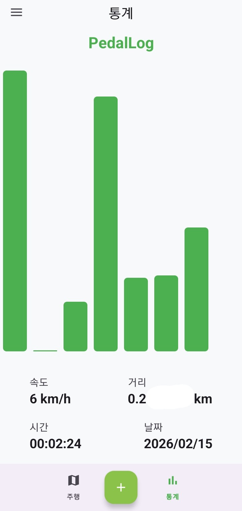
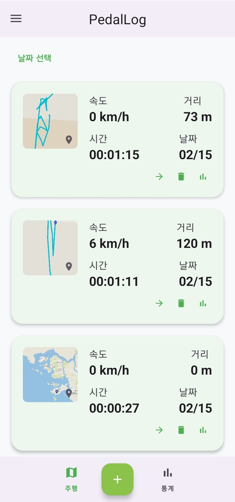
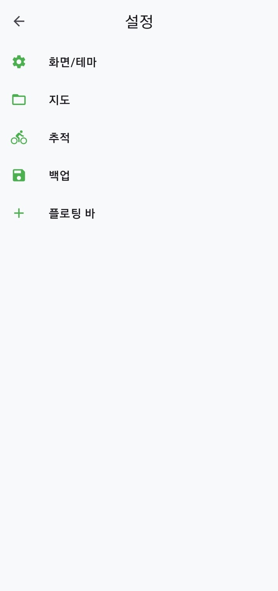

<h1 align="center">PedalLog</h1>
  

  

  
  
  

PedalLog is an Android tracking and stats app for cyclists. It records your rides with real-time GPS tracking and turns them into weekly/monthly insights.

> [!NOTE]
> This project is a fork of [ishantchauhan710/BikeRush](https://github.com/ishantchauhan710/BikeRush).

---

## Screenshots

| Tracking | Floating Bar | Statistics | Save & Keep | Settings |
|:---:|:---:|:---:|:---:|:---:|
|  |  |  |  |  |

---

## Key Features

- **Real-time tracking**: Uses a foreground service for accurate GPS paths and ride metrics, even in the background.
- **Offline maps**: Renders maps without a network connection using MapLibre, MBTiles, and a lightweight local HTTP server.
- **Ride analytics**: Calculates distance, time, calories, and average speed, and visualizes trends with charts.
- **Journey management**: Stores rides locally with Room and provides an interface to browse and manage them.
- **Permissions**: Simple and safe location permission handling with EasyPermissions.

---

## Tech Stack

- **Language**: Kotlin
- **Architecture**: MVVM with Clean Architecture principles
- **Dependency Injection**: Hilt
- **Database**: Room
- **UI**: Navigation Component, View Binding, Material Design
- **Maps**: MapLibre GL Android SDK, MBTiles
- **Async**: Coroutines & Flow
- **Logging**: Timber
- **Images**: Glide
- **Charts**: WilliamChart

---

## Getting Started

### Prerequisites

- Android Studio (latest stable)
- Android SDK installed via Android Studio

### Build & Run

1. Clone the repository.
2. Open the project in Android Studio.
3. Let Gradle sync.
4. Run the `app` configuration on a device or emulator.

You can also build from the command line:

- Windows (PowerShell): `./gradlew.bat assembleDebug`
- macOS/Linux: `./gradlew assembleDebug`

---

## Offline Map (MBTiles)

PedalLog supports offline maps via `.mbtiles`.

- Select an MBTiles file from **Settings**.
- The app will load tiles through a local server and render them in MapLibre.

---

## Contact

Questions or feedback: [PedalLog@hotmail.com](mailto:PedalLog@hotmail.com)
